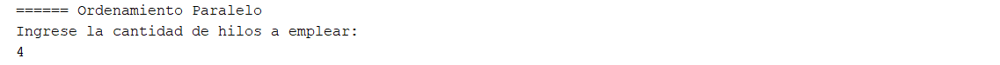
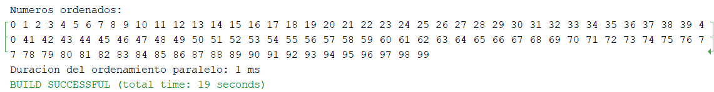

# Ordenamiento de arreglos con programación paralela

*Ejecución:* 

1. Ingresar los números a ordenar, por ejemplo:

> 47 3 85 26 58 12 94 7 76 35 90 18 42 60 5 71 29 87 15 49 66 31 24 79 53 8 95 2 68 11 77 37 14 88 22 63 46 1 80 20 40 19 51 83 13 73 6 92 33 55 17 59 23 81 48 9 70 16 74 38 67 25 84 4 61 21 89 30 64 10 50 36 75 41 57 27 96 0 65 28 62 32 82 45 34 72 39 97 43 93 78 44 98 54 99 56 91 52 86 69

2. Determinar si se ven los números ordenados *(S/N)*.

3. Resultado del ordenamiento secuencial.

4. Ingresar la cantidad de hilos para el ordenamiento paralelo.

5. Resultado del ordenamiento paralelo.

